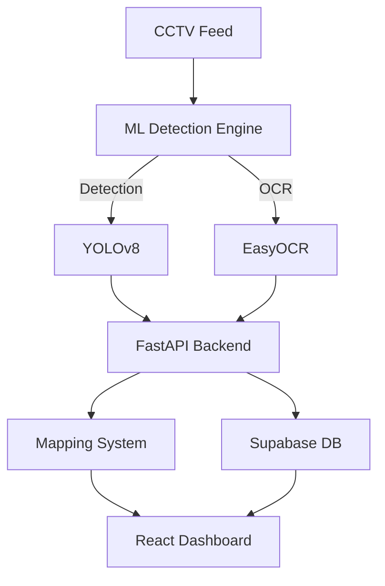

# SANJEEVANI

Because Accidents Shouldn’t Become Content.

## 💭 The Thought


When an accident happens, something strange happens too.

Humanity pauses.

Not always to help.  
But often to record.

Phones come out faster than first aid.

And what if I told you that almost 25% of people react this way?

That thought stayed.

And that thought gave birth to SANJEEVANI.

## 🧠 How It Started

At first, SANJEEVANI was just a Machine Learning project.

A simple idea:

Detect road accidents using AI.

Using computer vision, the model could detect when an accident occurred from CCTV footage.

But then we asked ourselves:

Detecting is good.  
But what happens after detection?

Because detection without action doesn’t save lives.

## 🔍 Then Came Number Plate Detection

The project expanded.

Now, SANJEEVANI not only detects accidents,  
but also detects the vehicle’s number plate using OCR (Optical Character Recognition).

And that created another thought:

If we can read the number plate…  
Can we use it to help the victim?

In India, a vehicle number plate is almost like an Aadhaar for the vehicle.

It connects to identity.

And identity connects to responsibility.

## 🗂 Simulated VAHAN Registry Integration

To make this possible, we built a Simulated VAHAN (Parivahan) Registry System for demonstration purposes.

When an accident occurs:

- The number plate is detected.
- Vehicle details are fetched.
- Owner information is retrieved.
- A secondary emergency contact is identified.

Why?

Because someone must be informed immediately.

Every second matters.

## 📍 Accident Location Intelligence

We also created a Statewide CCTV Location Mapping System (Kerala).

When an accident is detected:

- The camera location is identified.
- The exact accident location is determined.
- The nearest police station is found.
- The nearest ambulance service is located.
- The nearest hospital is identified.

With a single alert button, emergency services can be notified instantly.

No confusion.  
No delay.

## 🚑 Ambulance Dispatch & Live Tracking

We didn’t stop there.

Once the ambulance is dispatched:

- Live tracking is enabled.
- Family members can track it.
- Hospitals can monitor arrival time.
- Police can track movement.

Meanwhile, the system estimates accident severity.

So hospitals can prepare emergency medical teams before the patient arrives.

Preparation saves lives.

## ⚠️ Real-World Scenario vs Project Limitation

In real-world highways, most CCTV systems use PTZ (Pan-Tilt-Zoom) cameras.

These cameras:

- Capture high-resolution footage
- Zoom into vehicle number plates
- Improve detection accuracy significantly

However, in this project:

- Public datasets (Kaggle / YouTube) had low-quality CCTV visuals.
- OCR struggled to read unclear number plates.
- To demonstrate the complete workflow, some number plates were simulated.

The objective was to show how the system ecosystem works together —  
from detection to emergency response.

It is an automated emergency response framework.

## ✨ Key Features

- **Real-time Accident Detection**: YOLOv8-powered computer vision to detect incidents instantly.
- **Smart OCR Vehicle Tracking**: Automatic number plate recognition using EasyOCR.
- **VAHAN Registry Integration**: Simulated database to fetch vehicle owner and emergency contact details.
- **Geospatial Intelligence**: Maps accident locations to the nearest hospitals and police stations.
- **Live Tracking System**: Real-time ambulance dispatch and tracking for families and hospitals.
- **Analytics Dashboard**: Comprehensive data visualization of accident trends and response times.
- **Emergency Offline Mode**: Cached vehicle records remain accessible during connectivity failures, with automatic sync and unsynced search tracking on reconnection.

## 🔌 Emergency Offline Mode

SANJEEVANI includes an offline mode that ensures critical vehicle data remains accessible during connectivity failures.

### How it works
- When the backend is unreachable, a yellow **"Offline Mode Active"** banner appears with the last synced timestamp
- Recently searched vehicle records are automatically cached in localStorage
- Cached records (owner, phone, emergency contact, insurance, vehicle type) are served instantly when offline with a blue **"Cached"** badge
- Any plates searched while offline are queued and shown as an amber warning on reconnection so staff know to re-query them
- Cache entries automatically expire after **24 hours** for security

### Security Notes
- Cached data is Base64-encoded to prevent casual inspection
- For production deployments, replace with AES-GCM encryption via the Web Crypto API
- Cache is scoped with versioned keys (`sanjeevani_v1_`) to prevent collisions

## 🏗 System Architecture



Detailed documentation can be found in [Architecture Docs](./docs/Architecture.md).

##  Working Demo

Experience the system in action: [Sanjeevani - Working Demo](https://drive.google.com/drive/folders/1qhu3jCne-fNt81Jru8dO7fcHBwzJu6lP?usp=sharing)

## 📸 Screenshots

### 🖥️ Command Dashboard


### 🚨 Live Accident Feed


### 🗺️ Geospatial Accident Map


### 🎥 CCTV Monitoring & Detection


### 🔍 Vehicle Registry Lookup


## 🛠 Tech Stack

- **Frontend:** React, Vite, Tailwind CSS, Leaflet (Mapping), Recharts (Analytics), Lucide React (Icons)
- **Backend:** FastAPI (Python), Uvicorn, Pydantic
- **Machine Learning:** YOLOv8 (Accident Detection), EasyOCR (Number Plate Recognition), OpenCV
- **Database & Services:** Supabase (PostgreSQL), Python-Dotenv
- **Location Intelligence:** Geospatial Mapping with Leaflet

## 🚀 How to Run

To get SANJEEVANI up and running on your local machine, follow these steps:

### 1. Prerequisites
- Python 3.8+
- Node.js & npm
- A Supabase account (for the database)

### 2. Backend Setup
```bash
# Navigate to backend directory
cd backend

# Create and activate a virtual environment
python -m venv venv
source venv/bin/activate  # On Windows use: venv\Scripts\activate

# Install dependencies
pip install -r requirements.txt

# Set up environment variables
cp .env.example .env
# Then open .env and fill in your SUPABASE_URL and SUPABASE_KEY

# Start the FastAPI server
python main.py
```
The backend will be running at `http://localhost:8000`.

### 3. Frontend Setup
```bash
# Navigate to frontend directory
cd frontend

# Install dependencies
npm install

# Set up environment variables
cp .env.example .env
# Edit .env if your backend runs on a different port

# Start the development server
npm run dev
```
The dashboard will be available at `http://localhost:5173`.

### 4. Running the ML Detection
```bash
# Navigate to the ml directory
cd ml

# Install ML dependencies
pip install -r requirements.txt

# Ensure backend is running first!
# Run the detection script
python accident_detection.py
```

## 🎯 The Core Idea

Sanjeevani is built on a simple belief:

Even if humans hesitate,  
technology should not.

If humanity pauses…  
Sanjeevani responds.

## 🔮 Future Scope

- Integration with real VAHAN APIs
- Direct collaboration with emergency services
- PTZ camera integration for high-resolution detection
- Automated emergency dispatch without manual confirmation
- AI-based injury severity prediction improvement
- Statewide CCTV network integration

## Code of Conduct

Please note that this project is released with a [Code of Conduct](CODE_OF_CONDUCT.md). By participating in this project you agree to abide by its terms.

## 🤝🏻 Contributing Guide

Contributions make the open-source community an amazing place to learn, inspire and create. Any contributions you make are **greatly appreciated**. 
- View: [CONTRIBUTING.md](CONTRIBUTING.md)

1. Fork the Project
2. Create your Feature Branch (`git checkout -b feature/AmazingFeature`)
3. Commit your Changes (`git commit -m 'Add some AmazingFeature'`)
4. Push to the Branch (`git push origin feature/AmazingFeature`)
5. Open a Pull Request

## ❤️ Final Note

SANJEEVANI is not just an ML project.

It is an attempt to reduce the time between:

Accident → Response → Medical Action

Because when accidents happen,

Every second matters.

## 👥 Built BY
- [Ann Maria Jaison](https://github.com/Ann-Maria-Jaison) 

## 📜 License
This project is licensed under the [MIT License](./LICENSE).

<div align="center">

---
Made with lots of ❤️

---

**[⬆ Back to Top](#sanjeevani)**

</div>