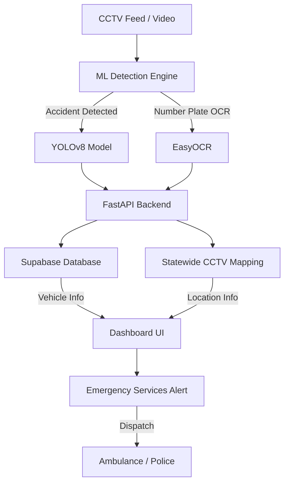

# System Architecture

SANJEEVANI is an integrated emergency response framework that combines Computer Vision, Real-time APIs, and Geospatial intelligence.

## Workflow
1. **Detection**: The ML engine monitors CCTV feeds for accidents.
2. **Identification**: Upon detection, the system identifies the vehicle via OCR.
3. **Information Retrieval**: The backend fetches owner and emergency contact details from the simulated registry.
4. **Location Mapping**: The system maps the camera location to find the nearest emergency services.
5. **Response**: A single click dispatches alerts to hospitals, ambulances, and police.
